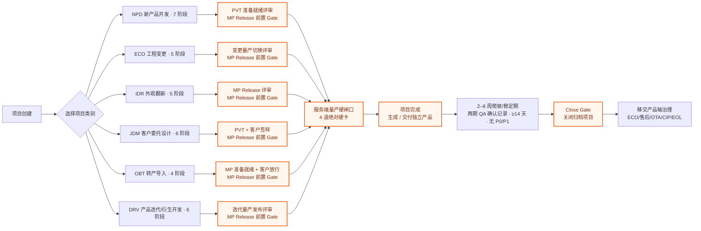
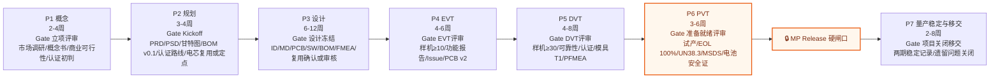
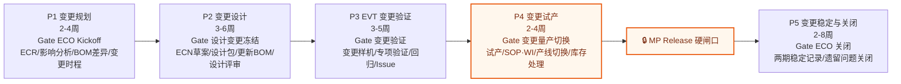
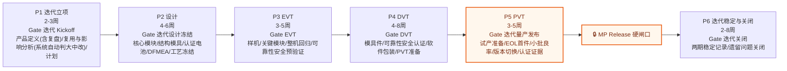
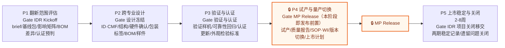
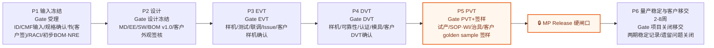
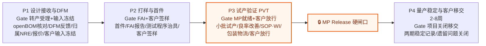
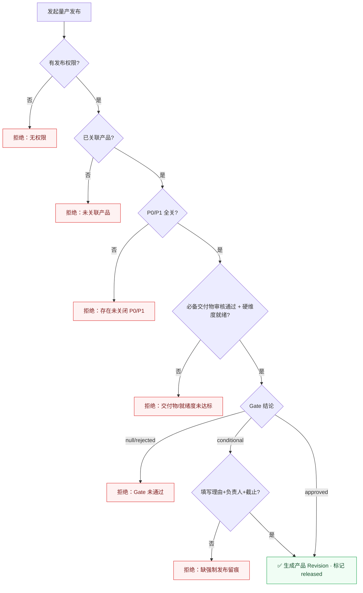

# SOP 流程设计文档（全量 6 类）

> **2026-07-14 轨道收敛**：IDR 已停止新建。包装、标签、文案、简单换色等无需多人协作的单点小改，在产品库使用“轻量产品变更”留痕，不创建项目；涉及结构、供应链、品质、认证、量产切换等多人跨专业协作的复杂外观/CMF 翻新并入 DRV。文档下方 IDR 章节仅保留历史项目兼容说明。

> **2026-07-14 PRM × PLM 解耦**：项目创建、任务、Gate 与流转不依赖 Product 或 Revision。项目完成时生成或交付一个独立产品；Revision 仅用于产品库内的包装、印刷、标签等轻微改版，不由项目发布产生。

> 生成日期：2026-06-29
> 来源（单一事实源）：`shared/sop-templates.ts`、`shared/effective-process.ts`、`shared/task-deliverables.ts`、`server/db.ts`（量产硬闸口）
> 替代：`docs/design/current-sop-flowcharts.md`（旧版仅覆盖 NPD/ECO/IDR 三类，已过期）
> 更新日期：2026-07-10。当前模板为 `2026-07-v2`；历史项目固定在 `2026-07-v1`，模板升级不追溯改写历史任务。
> 校验状态：6 个轨道均已拆分“量产版本发布 → 2–8 周稳定期 → Close Gate 关闭归档”。

---

## 1. 概念模型

```
ProjectCategory（6 类）
  └─ SOPPhase（阶段）            ── code / name / duration / color / gate
       ├─ gateTaskId            ── 指向本阶段的"评审任务"
       ├─ isReleaseGate?        ── 全类唯一，量产发布前置硬闸口的语义锚点
       ├─ deliverables[]        ── 阶段级交付物
       ├─ gateStandard          ── 入口/出口/必备交付物/责任角色/证据/例外策略
       └─ tasks[]               ── SOPTask：owner / guide / visibleRoles / durationDays / dependsOn
            └─ TASK_DELIVERABLES[taskId]  ── 任务级交付物模板（缺省回退阶段级）
```

前后端共用同一份模板：前端展示（`getPhasesForCategory`）与后端建项埋点（`server/sop-data.ts`）都从 `shared/` 读取，**不可漂移**。

### 6 类项目一览

| 代码 | 名称 | 入口语义 | 阶段数 | 量产硬闸口所在阶段 | 典型周期 |
|---|---|---|---|---|---|
| **NPD** | 新产品开发 | 概念立项（0→1） | 7 | P6 PVT 试产验证 | 5–8 个月 |
| **ECO** (`eco`) | 工程变更 | 换料、降成本、小范围设计变更、质量/合规整改 | 5 | P4 变更试产 | 1.5–3 个月 |
| **DRV** (`derivative`) | 产品迭代/衍生开发 | 大改款/中改款：1 代→2 代等代际升级（按模块复用策略裁剪深度） | 6 | P5 PVT | 3–5 个月 |
| **IDR** | 外观翻新 | 翻新 brief | 5 | P4 试产与量产切换（发布） | 2.5–4 个月 |
| **JDM** | 客户委托设计 | 设计输入冻结 | 6 | P5 PVT（客户 golden sample 签样） | 4–6 个月 |
| **OBT** | 转产导入 | openBOM 转产受理 | 4 | P3 PVT（客户放行） | 1.5–3 个月 |

> 各项目轨道统一遵循：发布 Gate 完成项目并生成/交付独立产品，随后进入稳定期；Close Gate 才关闭归档项目。Revision 不进入项目流程，仅在产品库记录包装、印刷、标签等轻微改版。

---

## 2. SOP 总览



---

## 3. NPD 新产品开发（7 阶段）



任务骨架（gateTaskId 即每阶段末尾评审任务）：

- **P1 概念** c1 竞品分析 → c2 VoC → c3 概念定义 → c4 技术可行性/认证初判 → c5 商业可行性 → **c6 立项评审**
- **P2 规划** p1 PRD → p2 PSD → p3 时程 → p4 BOM初版 → p5 供应商初选 → p5a 电芯复用/定点/二供 → p6a 认证路线图 → p6 团队组建 → **p7 Kickoff**
- **P3 设计** d1 ID → d2 MD → d3 EE原理/保护输入 → d4 PCB → d5 SW → d6 DFM/DFA → d6a 安全FMEA/危害分析 → d7 料件定型 → d7a 电芯厂审核/复用确认 → d7b 保护电路评审/复用确认 → **d8 设计冻结**
- **P4 EVT** e1 样机 → e2 功能 → e3 性能 → e4 联调 → e5 Issue → e6 PCB v2 → **e7 EVT评审**
- **P5 DVT** v1 样机 → v2 可靠性 → v3 电池/运输/整机认证 → v4 模具T1/T2 → v5 软件全测 → v6 包装 → v7 PFMEA/CTQ → **v8 DVT评审**
- **P6 PVT** 🔒 pv1 试产规划 → pv2 SOP/WI → pv3 治具/程序/EOL 100% → pv4 试产 → pv5 良率改善 → pv6 包装物流 → pv7 限度样本/安全性能标准 → **pv8 PVT评审**
- **P7 稳定与关闭** stability_ramp 首批量产与爬坡 → stability_metrics 良率、质量与产能稳定确认 → stability_issues 遗留问题关闭与受控转交 → **project_close_review 项目关闭评审**

---

## 4. ECO 工程变更（5 阶段，category id: `eco`）



任务骨架：ep1 ECR 变更需求 → ep2 影响范围评估 → ep3 BOM 差异 → ep4 变更时程 → ep5 资源与供应商 → ep6 CCB 评审 → **ep7 ECO Kickoff** ｜ ed1 硬件变更 → ed2 结构变更 → ed3 软件变更 → ed4 DFM 变更评审 → ed5 认证影响评估 → **ed6 设计变更冻结** ｜ ev1 变更样机 → ev2 变更点专项验证 → ev3 回归测试 → ev4 可靠性关键项 → **ev5 变更验证评审** ｜ 🔒 epv1 产线变更准备 → epv2 变更试产 → epv3 库存与在制品处理 → epv4 ECN 正式发布 → **epv5 变更量产切换评审** ｜ stability_ramp → stability_metrics → stability_issues → **project_close_review**

> 关键约束：ECO 是工程变更项目，适用于换料、降成本、供应商替代、小范围设计变更、质量/合规整改等极小改。若变更已经触及大改款/中改款的二代产品定义、机芯/电池平台升级、大范围外壳模具变化或需要完整 EVT/DVT/PVT 验证，应转入 DRV 产品迭代/衍生开发。

---

## 5. DRV 产品迭代/衍生开发（6 阶段，category id: `derivative`）



任务骨架（当前模板）：di1 产品定义与代际目标（含一代问题复盘） → di2 模块复用与影响分析（复用策略+BOM/资源/供应影响一份文档；大/中改与 Gate 深度由系统按策略自动判定） → di5 迭代计划与裁剪矩阵 → **di6 Kickoff** ｜ dd1 电池/电源 → dd2 机芯/泵体 → dd3 PCBA/主控 → dd4 软件/固件 → dd5 结构装配 → dd6 DFM/DFT/DFMEA与验证计划 → dd7 投模评审/开模批准 → dd8 模具开发与T0准备 → dd9 认证/电池安全与验证计划 → **dd10 设计冻结** ｜ de1 EVT样机 → de2 关键模块专项验证 → de3 整机回归 → de4 可靠性与安全预验证（按风险选做） → de5 问题关闭/DVT输入冻结 → **de6 EVT评审** ｜ dv1 DVT样机 → dv2 T1试模与模具问题清单 → dv3 T2/修模验证与限度样本 → dv4 可靠性/安全/认证验证 → dv5 软件/包装/物流完整验证 → dv6 问题关闭/PVT准备 → **dv7 DVT评审** ｜ 🔒 dp1 PVT试产准备 → dp2 治具/EOL与首件验收 → dp3 小批试产 → dp4 试产问题关闭与良率改善 → dp5 版本切换与文件发布 → **dp6 量产发布评审** ｜ stability_ramp → stability_metrics → stability_issues → **project_close_review**

> 关键约束：DRV 只针对大改款/中改款的二代或衍生开发项目，不是普通 ECO，也不是纯 IDR 外观翻新。极小改仍走 ECO；纯换色、CMF、包装标签或外观翻新走 IDR。DRV 必须先冻结一代基线、目标代际和模块复用策略与流程裁剪矩阵；旧模块可直接复用时，可减少对应设计、样机、可靠性、认证或工艺深度，但必须保留复用证据、边界说明、整机回归和发布硬闸口。

大/中改判定以模块复用情况为核心输入，并直接决定交付物和 Gate 深度：
- **大改款**：核心平台、机芯、电池体系、主结构/模具或认证路径发生重大变化，或多个关键模块需要重新开发；原则上执行完整 EVT/DVT/PVT Gate 深度和全量关键交付物。
- **中改款**：平台和核心架构可复用，仅部分模块轻量修改或适配验证；可基于复用证据采用差异化 Gate 深度、交付物深度和选做验证项，但发布硬闸口、整机回归和安全/认证边界不得删除。

流程裁剪操作口径：
- **项目级流程策略**：在项目设置中按模块类型（电池、机芯、PCBA/电源、软件、结构/模具、包装/认证）选择复用等级，并由该策略绑定保留任务、可选任务、交付物深度和 Gate 深度。
- **时间节点**：P1 输出模块复用策略初版，Gate1 冻结复用等级和 Gate 深度；Gate2 设计冻结前复核验证矩阵；EVT Gate 关闭选做/跳过项；DVT Gate 确认 PVT 保留项，之后变化走 ECO 或变更记录。
- **交付物删减**：在对应 Gate 任务的交付物区执行“排除/恢复”，排除时必须填写理由并留审计记录。
- **不可裁剪边界**：量产发布 Gate、整机集成回归、安全/认证边界、风险接受人、DVT/PVT 保留验证项不得删除。

EVT 可选项口径：
- 重新开发模块必须做 EVT 专项；轻量修改模块做差异验证；直接复用且边界未变模块可减少对应专项或可靠性预验证。
- 即使多个模块直接复用，也必须保留整机功能/兼容回归、问题清单、EVT 可选项裁剪记录和 DVT 输入确认。
- 发生电芯/电池包/保护方案、热路径、主承力结构、目标市场认证或运输边界变化时，不得裁剪相关安全/认证预验证。

---

## 6. IDR 外观翻新（历史兼容，已停止新建）



任务骨架：ir1 边界定义 → ir2 基线盘点 → ir3 影响评估 → ir4 新物料策略 → ir5 认证预判 → **ir6 Kickoff** ｜ id1 ID/CMF → id2 结构模具 → id3 硬件适配 → id4 包装标签铭牌 → id5 BOM/ECN草案 → id6 打样FAI → **id7 设计冻结** ｜ iv1 验证样机 → iv2 装配 → iv3 功能回归 → iv4 可靠性耐久 → iv5 认证更新 → iv6 外观检验标准 → **iv7 验证认证评审** ｜ 🔒 im1 切换准备 → im2 小批/首批 → im3 物料库存切换 → im4 文件认证发布 → im5 市场渠道切换 → **im6 MP Release评审** ｜ stability_ramp → stability_metrics → stability_issues → **project_close_review**

> 升级规则：若翻新触及新增核心功能、平台级硬件或电芯体系变化 → 升级为 DRV/NPD，不得留在 IDR 轨。

---

## 7. JDM 客户委托设计（6 阶段）

> 客户出 ID/规格，工厂做 MD/EE/SW 并量产。差异：以「设计输入冻结」替代概念/规划入口；**每个关键 Gate 强制客户签核**，签核以"必交付物"落地，经 deliverable-review 服务校验。



客户签核落点（结构化必签槽位）：JDM 每轮 Gate 的客户槽位均为必签；发布前仍须完成 jp6 客户 golden sample 签样，发布后由 `project_close_review` 完成关闭移交。

---

## 8. OBT 转产导入（4 阶段）

> 客户出完整设计 + openBOM，工厂纯生产。核心 = DFM 反馈 + 料件齐套 + 治具/测试程序；客户签样/放行强制。



任务骨架：or1 openBOM核对 → or2 图纸规格核对 → or3 DFM反馈 → or4 料件齐套 → or5 模具治具归属NRE → or6 报价 → **or7 受理+输入冻结(客户确认)** ｜ os1 首件 → os2 FAI → os3 测试治具 → os4 客户确认 → **os5 首件确认(客户签样)** ｜ 🔒 op1 小批试产 → op2 良率改善 → op3 SOP/WI → op4 包装物流 → **op5 MP就绪(客户放行)** ｜ stability_ramp → stability_metrics → stability_issues → **project_close_review**

---

## 9. 流程裁剪（Tailoring）与有效流程（Effective Process）

`shared/effective-process.ts` 在模板之上叠加"项目级裁剪"，产出每个项目实际执行的流程：

- **阶段裁剪**：整阶段标记 `tailored` → 该阶段不执行，其模板交付物**归集（carry-forward）到下一个未裁剪阶段**（`carriedDeliverables` 记录来源阶段）。
- **例外任务裁剪**：保留为非 DRV 的异常处理能力，不作为 DRV 主路径；DRV 以项目设置中的模块复用策略决定流程深度。
- **交付物 override**：在未裁剪阶段对单个交付物做 `add` / `remove` 调整。
- **有效提交集** `submittedDeliverables` = 模板交付物 ∪ gateStandard.requiredDeliverables，经裁剪归集与 override 计算后的最终应交清单。
- **DRV 模块复用裁剪**：立项阶段输出“模块复用策略与流程裁剪矩阵”和“大/中改判定与 Gate 深度建议”，把旧模块分为直接复用、复用但需适配验证、轻量修改、重新开发；复用程度决定大改款/中改款判断，并牵动交付物深度、Gate 深度和可选验证项。直接复用模块可减少对应设计/验证/工艺深度，但需保留复用证据、适用边界、整机回归和 Gate 决策记录。

**裁剪保护硬约束**（`assertNoReleaseGateTailoring`）：

```
若目标是 isReleaseGate 阶段（整阶段）        → 抛错「MP Release 阶段不可裁剪」
若目标是 isReleaseGate 阶段的 gateTaskId 任务 → 抛错「MP Release Gate 任务不可裁剪」
```

被裁剪阶段的 Gate 就绪度视为 N/A（不阻塞）。

---

## 10. 量产发布硬闸口（MP Release Hard Gate）

发布动作 `releaseProject()` 是不可绕过的硬卡。发布成功后生成或交付一个独立产品，不生成 Revision；产品后续发生包装、印刷、标签等轻微改版时，才在产品库生成 Revision（Rev A/B/C…）。

NPD 的 PVT 发布前置 Gate 已把锂电/充气泵类关键证据固化为必备交付物：`EOL 100%测试能力验收记录`、`UN38.3运输测试报告或复用确认`、`MSDS`、`电芯/电池包安全认证报告或复用确认`。这些证据会进入有效提交集，缺失或未审核通过时，量产发布硬闸口不能放行。

电池相关节点支持按复用程度裁剪：若项目复用已批准的 18650/21700/聚合物电芯或平台电池包，且电流、温升、充电、结构固定、运输和目标市场边界未超出原批准范围，可提交“复用有效性确认 + 产品适配验证”替代全量电芯厂审核或重新认证；若新增电芯/电池包、二供切换、保护方案变化、结构热路径变化或认证范围不覆盖，则必须走完整审核、验证和认证路径。

### 10.1 Gate 就绪度 4 维度（`getGateReadiness`）

| 维度 | 含义 | 阻塞性 |
|---|---|---|
| `prereq` | 本阶段除评审任务外的前置任务均完成（done/skipped/completed） | 硬 |
| `deliverables` | 有效提交集内的必备交付物均**审核通过**（非仅上传，经 deliverable-review） | 硬 |
| `criticalIssues` | 本阶段无未关闭 P0/P1 | 硬 |
| `review_conditions` | 最新评审结论的条件项 | 发布时可授权留痕；自动转受控条件项并在 Close Gate 硬阻塞 |

### 10.2 发布时 3 道绝对硬卡（`releaseProject`）

```
0. 权限：仅 项目创建人 / PM / 项目 owner|manager / 系统 admin（isReleaseOverrideAuthorized）
1. 项目级 P0/P1 全部关闭                     否则「存在 N 个未关闭的 P0/P1 问题」
2. 前置 Gate 必备交付物审核通过              否则「必备交付物未审核通过 (done/total)」
   + 其余硬维度（prereq 等）全部 ok
3. 前置 Gate 有评审记录且结论 ≠ rejected     否则「前置 Gate 未通过」

conditional（有条件通过）：必须由授权用户填写【理由 + 跟进负责人 + 截止日期】强制发布并留痕
发布条件沿用 `mp_releases` 快照字段，同时关联统一 `project_conditions`；延期仍保持 open，只有关闭或转同产品 ECO 才解除 Close 阻塞。
重复发布保护：advisory lock + mp_releases 唯一性 → 「项目已发布，不能重复发布」
```



---

## 11. 校验与建议

**审计结论（2026-07-10）**：6 类阶段数与配置一致；每类各有唯一发布 Gate 与独立 Close Gate；IDR 为五阶段；当前项目使用版本化模板，历史项目不被追溯改写。

**待办建议**：
1. ✅（本文档已修复）旧版 `current-sop-flowcharts.md` 仅 3 类，建议以本文档替代或在旧文件加跳转指引。
2. P3 知识治理池暂缓，下一轮评估项目复盘、决策沉淀和可复用知识回流。
