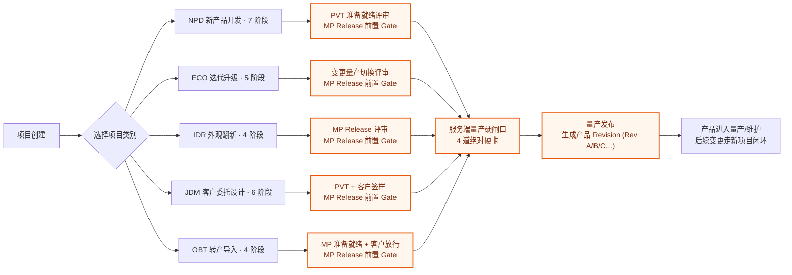
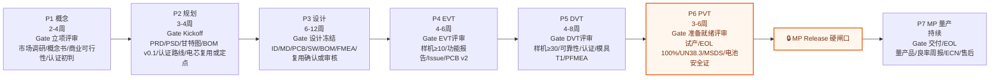
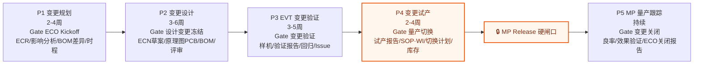
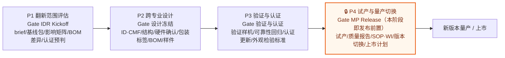
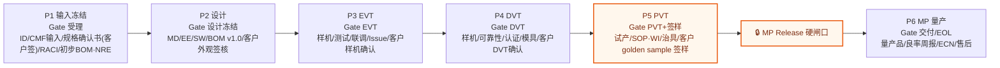
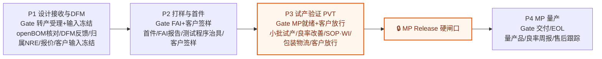
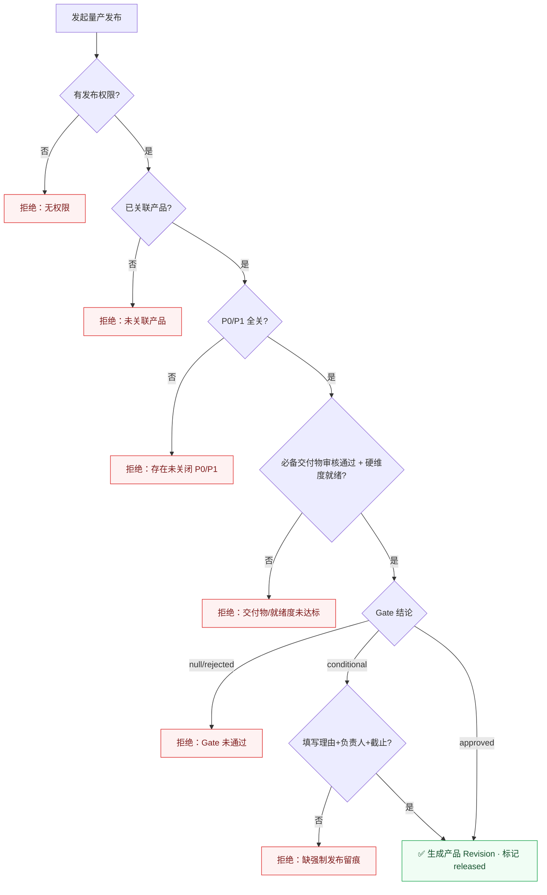

# SOP 流程设计文档（全量 5 类）

> 生成日期：2026-06-29
> 来源（单一事实源）：`shared/sop-templates.ts`、`shared/effective-process.ts`、`shared/task-deliverables.ts`、`server/db.ts`（量产硬闸口）
> 替代：`docs/design/current-sop-flowcharts.md`（旧版仅覆盖 NPD/ECO/IDR 三类，已过期）
> 校验状态：结构化审计 0 问题；SOP/裁剪/交付物审核/量产发布 测试 32/32 通过。

---

## 1. 概念模型

```
ProjectCategory（5 类）
  └─ SOPPhase（阶段）            ── code / name / duration / color / gate
       ├─ gateTaskId            ── 指向本阶段的"评审任务"
       ├─ isReleaseGate?        ── 全类唯一，量产发布前置硬闸口的语义锚点
       ├─ deliverables[]        ── 阶段级交付物
       ├─ gateStandard          ── 入口/出口/必备交付物/责任角色/证据/例外策略
       └─ tasks[]               ── SOPTask：owner / guide / visibleRoles / durationDays / dependsOn
            └─ TASK_DELIVERABLES[taskId]  ── 任务级交付物模板（缺省回退阶段级）
```

前后端共用同一份模板：前端展示（`getPhasesForCategory`）与后端建项埋点（`server/sop-data.ts`）都从 `shared/` 读取，**不可漂移**。

### 5 类项目一览

| 代码 | 名称 | 入口语义 | 阶段数 | 量产硬闸口所在阶段 | 典型周期 |
|---|---|---|---|---|---|
| **NPD** | 新产品开发 | 概念立项（0→1） | 7 | P6 PVT 试产验证 | 5–8 个月 |
| **ECO** | 迭代升级 | ECR 工程变更 | 5 | P4 变更试产 | 2–3 个月 |
| **IDR** | 外观翻新 | 翻新 brief | 4 | P4 试产与量产切换（**末阶段即发布**） | 2–3 个月 |
| **JDM** | 客户委托设计 | 设计输入冻结 | 6 | P5 PVT（客户 golden sample 签样） | 4–6 个月 |
| **OBT** | 转产导入 | openBOM 转产受理 | 4 | P3 PVT（客户放行） | 1.5–3 个月 |

> ⚠️ 不对称点：NPD/ECO/JDM/OBT 都是"发布闸口 → 独立 MP 量产跟踪阶段"；**IDR 的发布闸口压在最后一个阶段**，没有发布后跟踪阶段。作为轻量翻新轨可接受，需知悉。

---

## 2. SOP 总览



---

## 3. NPD 新产品开发（7 阶段）



任务骨架（gateTaskId 即每阶段末尾评审任务）：

- **P1 概念** c1 竞品分析 → c2 VoC → c3 概念定义 → c4 技术可行性/认证初判 → c5 商业可行性 → **c6 立项评审**
- **P2 规划** p1 PRD → p2 PSD → p3 时程 → p4 BOM初版 → p5 供应商初选 → p5a 电芯复用/定点/二供 → p6a 认证路线图 → p6 团队组建 → **p7 Kickoff**
- **P3 设计** d1 ID → d2 MD → d3 EE原理/保护输入 → d4 PCB → d5 SW → d6 DFM/DFA → d6a 安全FMEA/危害分析 → d7 料件定型 → d7a 电芯厂审核/复用确认 → d7b 保护电路评审/复用确认 → **d8 设计冻结**
- **P4 EVT** e1 样机 → e2 功能 → e3 性能 → e4 联调 → e5 Issue → e6 PCB v2 → **e7 EVT评审**
- **P5 DVT** v1 样机 → v2 可靠性 → v3 电池/运输/整机认证 → v4 模具T1/T2 → v5 软件全测 → v6 包装 → v7 PFMEA/CTQ → **v8 DVT评审**
- **P6 PVT** 🔒 pv1 试产规划 → pv2 SOP/WI → pv3 治具/程序/EOL 100% → pv4 试产 → pv5 良率改善 → pv6 包装物流 → pv7 限度样本/安全性能标准 → **pv8 PVT评审**
- **P7 MP** mp1 首批量产 → mp2 良率监控 → mp3 产能爬坡 → mp4 工程变更 → mp5 售后 → **mp6 持续改善**

---

## 4. ECO 迭代升级（5 阶段）



任务骨架：ep1 ECR → ep2 影响 → ep3 BOM差异 → ep4 时程 → ep5 资源 → ep6 CCB → **ep7 Kickoff** ｜ ed1 硬件 → ed2 结构 → ed3 软件 → ed4 DFM → ed5 认证影响 → **ed6 设计冻结** ｜ ev1 样机 → ev2 专项验证 → ev3 回归 → ev4 可靠性 → **ev5 验证评审** ｜ 🔒 epv1 产线准备 → epv2 试产 → epv3 库存处理 → epv4 ECN发布 → **epv5 量产切换评审** ｜ em1 监控 → em2 效果验证 → em3 售后 → **em4 ECO关闭**

> 关键约束：变更治理走 **CCB（变更评审委员会）** 决策；ECR→CCB→ECN 形成闭环。

---

## 5. IDR 外观翻新（4 阶段）



任务骨架：ir1 边界定义 → ir2 基线盘点 → ir3 影响评估 → ir4 新物料策略 → ir5 认证预判 → **ir6 Kickoff** ｜ id1 ID/CMF → id2 结构模具 → id3 硬件适配 → id4 包装标签铭牌 → id5 BOM/ECN草案 → id6 打样FAI → **id7 设计冻结** ｜ iv1 验证样机 → iv2 装配 → iv3 功能回归 → iv4 可靠性耐久 → iv5 认证更新 → iv6 外观检验标准 → **iv7 验证认证评审** ｜ 🔒 im1 切换准备 → im2 小批/首批 → im3 物料库存切换 → im4 文件认证发布 → im5 市场渠道切换 → **im6 MP Release评审**

> 升级规则：若翻新触及新增核心功能、平台级硬件或电芯体系变化 → 升级为 ECO/NPD，不得留在 IDR 轨。

---

## 6. JDM 客户委托设计（6 阶段）

> 客户出 ID/规格，工厂做 MD/EE/SW 并量产。差异：以「设计输入冻结」替代概念/规划入口；**每个关键 Gate 强制客户签核**，签核以"必交付物"落地，经 deliverable-review 服务校验。



客户签核落点（强制交付物）：jin5 规格确认书 → jd7 客户外观签核 → je6 客户样机确认 → jv6 客户 DVT 确认 → **jp6 客户 golden sample 签样（发布前置）** → jm5 交付/EOL。

---

## 7. OBT 转产导入（4 阶段）

> 客户出完整设计 + openBOM，工厂纯生产。核心 = DFM 反馈 + 料件齐套 + 治具/测试程序；客户签样/放行强制。



任务骨架：or1 openBOM核对 → or2 图纸规格核对 → or3 DFM反馈 → or4 料件齐套 → or5 模具治具归属NRE → or6 报价 → **or7 受理+输入冻结(客户确认)** ｜ os1 首件 → os2 FAI → os3 测试治具 → os4 客户确认 → **os5 首件确认(客户签样)** ｜ 🔒 op1 小批试产 → op2 良率改善 → op3 SOP/WI → op4 包装物流 → **op5 MP就绪(客户放行)** ｜ om1 首批量产 → om2 良率监控 → om3 售后 → **om4 交付/EOL**

---

## 8. 流程裁剪（Tailoring）与有效流程（Effective Process）

`shared/effective-process.ts` 在模板之上叠加"项目级裁剪"，产出每个项目实际执行的流程：

- **阶段裁剪**：整阶段标记 `tailored` → 该阶段不执行，其模板交付物**归集（carry-forward）到下一个未裁剪阶段**（`carriedDeliverables` 记录来源阶段）。
- **任务裁剪**：单任务标记，不阻塞 Gate 就绪度。
- **交付物 override**：在未裁剪阶段对单个交付物做 `add` / `remove` 调整。
- **有效提交集** `submittedDeliverables` = 模板交付物 ∪ gateStandard.requiredDeliverables，经裁剪归集与 override 计算后的最终应交清单。

**裁剪保护硬约束**（`assertNoReleaseGateTailoring`）：

```
若目标是 isReleaseGate 阶段（整阶段）        → 抛错「MP Release 阶段不可裁剪」
若目标是 isReleaseGate 阶段的 gateTaskId 任务 → 抛错「MP Release Gate 任务不可裁剪」
```

被裁剪阶段的 Gate 就绪度视为 N/A（不阻塞）。

---

## 9. 量产发布硬闸口（MP Release Hard Gate）

发布动作 `releaseProject()` 是不可绕过的硬卡，发布成功即生成产品 Revision（Rev A/B/C…）。

NPD 的 PVT 发布前置 Gate 已把锂电/充气泵类关键证据固化为必备交付物：`EOL 100%测试能力验收记录`、`UN38.3运输测试报告或复用确认`、`MSDS`、`电芯/电池包安全认证报告或复用确认`。这些证据会进入有效提交集，缺失或未审核通过时，量产发布硬闸口不能放行。

电池相关节点支持按复用程度裁剪：若项目复用已批准的 18650/21700/聚合物电芯或平台电池包，且电流、温升、充电、结构固定、运输和目标市场边界未超出原批准范围，可提交“复用有效性确认 + 产品适配验证”替代全量电芯厂审核或重新认证；若新增电芯/电池包、二供切换、保护方案变化、结构热路径变化或认证范围不覆盖，则必须走完整审核、验证和认证路径。

### 9.1 Gate 就绪度 4 维度（`getGateReadiness`）

| 维度 | 含义 | 阻塞性 |
|---|---|---|
| `prereq` | 本阶段除评审任务外的前置任务均完成（done/skipped/completed） | 硬 |
| `deliverables` | 有效提交集内的必备交付物均**审核通过**（非仅上传，经 deliverable-review） | 硬 |
| `criticalIssues` | 本阶段无未关闭 P0/P1 | 硬 |
| `review_conditions` | 最新评审结论的条件项 | 软（不阻塞硬卡） |

### 9.2 发布时 4 道绝对硬卡（`releaseProject`）

```
0. 权限：仅 项目创建人 / PM / 项目 owner|manager / 系统 admin（isReleaseOverrideAuthorized）
1. 项目必须已关联产品（productId）          否则「项目未关联产品，无法发布」
2. 项目级 P0/P1 全部关闭                     否则「存在 N 个未关闭的 P0/P1 问题」
3. 前置 Gate 必备交付物审核通过              否则「必备交付物未审核通过 (done/total)」
   + 其余硬维度（prereq 等）全部 ok
4. 前置 Gate 有评审记录且结论 ≠ rejected     否则「前置 Gate 未通过」

conditional（有条件通过）：必须由授权用户填写【理由 + 跟进负责人 + 截止日期】强制发布并留痕
重复发布保护：advisory lock + mp_releases 唯一性 → 「项目已发布，不能重复发布」
```



---

## 10. 校验与建议

**审计结论（2026-06-29，2026-07-01 更新 NPD 电池安全节点后复核）**：模板结构 0 缺陷；5 类阶段数与配置一致；每类唯一量产硬闸口；164 任务 id 无重复；82 交付物模板全部命中；本次聚焦测试 50/50 通过。

**待办建议**：
1. ✅（本文档已修复）旧版 `current-sop-flowcharts.md` 仅 3 类，建议以本文档替代或在旧文件加跳转指引。
2. 评估是否给 IDR 也补一个发布后跟踪阶段，与其余四类对齐（当前为有意精简，非缺陷）。
