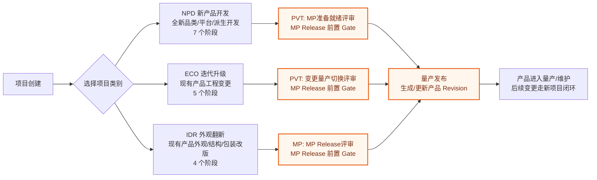
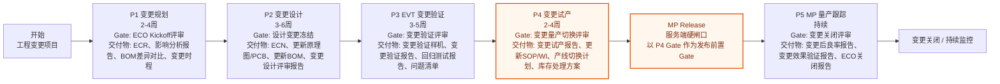
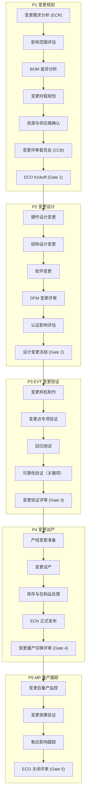
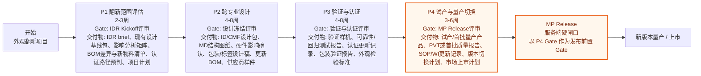
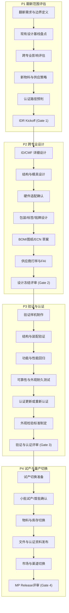

# 当前 SOP 流程图

> 来源：`shared/sop-templates.ts` 当前模板定义。  
> 范围：NPD 新产品开发、ECO 迭代升级、IDR 外观翻新。  
> 说明：标记为 `MP Release 前置 Gate` 的节点是系统量产发布硬闸口的语义锚点。

## SOP 总览

## NPD 新产品开发

```mermaid
flowchart LR
  N0["开始<br/>新产品开发项目"] --> N1["P1 概念阶段<br/>2-4周<br/>Gate: 立项评审 / Project Charter<br/>交付物: 市场调研报告、产品概念书、商业可行性分析、立项申请书"]
  N1 --> N2["P2 规划阶段<br/>3-4月<br/>Gate: Kickoff评审<br/>交付物: PRD、PSD、项目甘特图、BOM v0.1"]
  N2 --> N3["P3 设计阶段<br/>6-12周<br/>Gate: 设计冻结评审<br/>交付物: ID外观图、MD结构图、PCB原理图&Layout、SW架构文档、BOM v1.0"]
  N3 --> N4["P4 EVT 工程验证<br/>4-6周<br/>Gate: EVT评审<br/>交付物: EVT样机、功能测试报告、问题清单、PCB v2"]
  N4 --> N5["P5 DVT 设计验证<br/>4-8周<br/>Gate: DVT评审<br/>交付物: DVT样机、可靠性测试报告、认证报告、模具T1样品"]
  N5 --> N6["P6 PVT 试产验证<br/>3-6周<br/>Gate: MP准备就绪评审<br/>交付物: 试产50-300台、SOP/WI、良率报告、治具与测试程序"]
  N6 --> NRelease["MP Release<br/>服务端硬闸口<br/>产品关联、P0/P1、交付物、Gate决议校验"]
  NRelease --> N7["P7 MP 量产阶段<br/>持续<br/>Gate: 产品交付/EOL<br/>交付物: 量产产品、良率周报、ECN/ECR记录、售后数据分析"]
  N7 --> NEnd["持续改善 / EOL"]

  classDef release fill:#fff7ed,stroke:#ea580c,color:#7c2d12,stroke-width:2px;
  class N6,NRelease release;
```

### NPD 任务骨架

```mermaid
flowchart TB
  subgraph N1["P1 概念阶段"]
    C1["市场调研与竞品分析"] --> C2["用户需求收集 (VoC)"] --> C3["产品概念定义"]
    C3 --> C4["技术可行性评估"] --> C5["商业可行性分析"] --> C6["立项评审 (Gate 1)"]
  end

  subgraph N2["P2 规划阶段"]
    P1["产品需求文档 (PRD)"] --> P2["产品规格书 (PSD)"] --> P3["项目时程规划"]
    P3 --> P4["BOM初版"] --> P5["关键供应商初选"] --> P6["团队组建与资源分配"] --> P7["Kickoff会议"]
  end

  subgraph N3["P3 设计阶段"]
    D1["ID 工业设计"] --> D2["MD 结构设计"] --> D3["EE 电子原理设计"] --> D4["PCB Layout"]
    D4 --> D5["SW 软件架构"] --> D6["DFM/DFA 评审"] --> D7["关键料件定型"] --> D8["设计冻结评审 (Gate 3)"]
  end

  subgraph N4["P4 EVT 工程验证"]
    E1["工程样机制作"] --> E2["功能测试 (FT)"] --> E3["性能测试 (PT)"] --> E4["软硬件联调"]
    E4 --> E5["设计问题清单"] --> E6["PCB改板 (v2)"] --> E7["EVT评审 (Gate 4)"]
  end

  subgraph N5["P5 DVT 设计验证"]
    V1["DVT样机制作"] --> V2["可靠性测试"] --> V3["安规与认证"] --> V4["模具T1/T2试模"]
    V4 --> V5["软件功能完整测试"] --> V6["包装设计验证"] --> V7["量产工艺评估"] --> V8["DVT评审 (Gate 5)"]
  end

  subgraph N6["P6 PVT 试产验证"]
    PV1["试产规划"] --> PV2["SOP/WI制定"] --> PV3["治具与测试程序"] --> PV4["试产 (50-300台)"]
    PV4 --> PV5["良率分析与改善"] --> PV6["包装与物流验证"] --> PV7["品质标准固化"] --> PV8["PVT评审 (Gate 6)"]
  end

  subgraph N7["P7 MP 量产阶段"]
    MP1["首批量产 (Ramp-up)"] --> MP2["良率监控与改善"] --> MP3["产能爬坡"]
    MP3 --> MP4["工程变更管理"] --> MP5["售后问题跟踪"] --> MP6["持续改善 (CIP)"]
  end

  C6 --> P1
  P7 --> D1
  D8 --> E1
  E7 --> V1
  V8 --> PV1
  PV8 --> MP1
```

## ECO 迭代升级

### ECO 任务骨架

## IDR 外观翻新

### IDR 任务骨架

