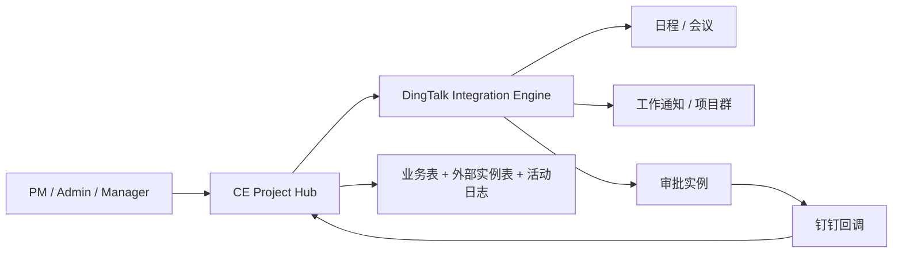
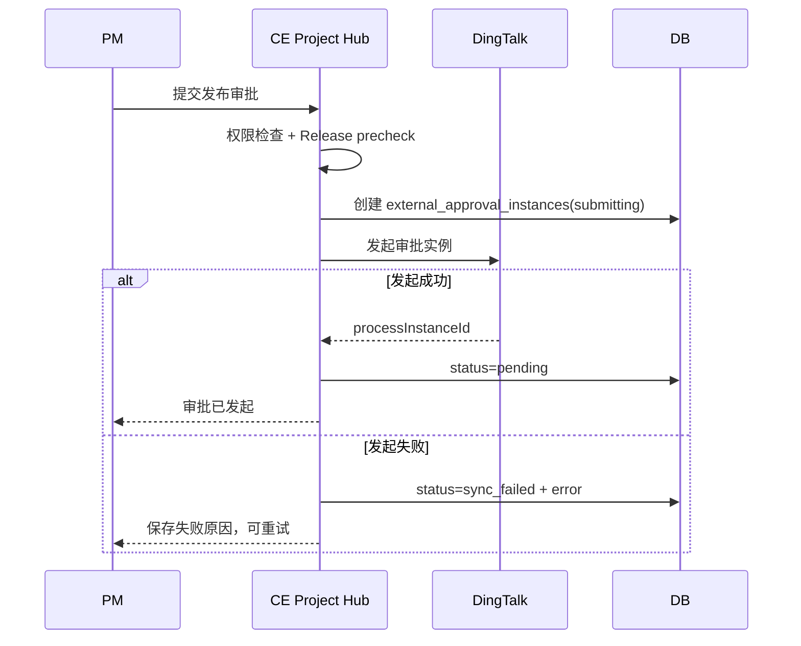
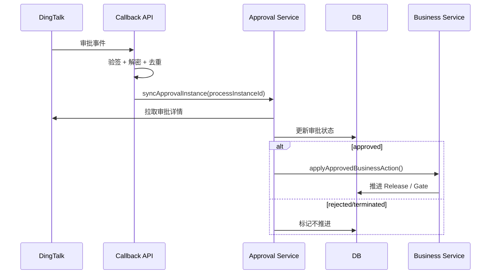

# 钉钉引擎优化 + 审批流设计

- 日期：2026-06-27
- 状态：设计稿，待评审后进入实施
- 范围：钉钉日程 / 项目群 / 工作通知的可靠性补强，以及钉钉审批流底座与首批业务审批接入
- 相关文档：
  - `docs/superpowers/specs/2026-06-14-dingtalk-calendar-meeting-design.md`
  - `docs/superpowers/specs/2026-06-14-scheduling-engine-design.md`
  - `docs/design/2026-06-16-mp-release-hard-gate-design.md`
  - `docs/superpowers/specs/2026-06-25-task-detail-redesign-design.md`

## 1. Summary

本设计把当前分散的钉钉能力升级成一个可观测、可重试、可补偿的“钉钉协同引擎”。第一阶段先补齐现有日程、项目群、工作通知的可靠性缺口，再新增钉钉审批流底座，并优先接入 MP Release 与 Gate 条件通过 / 强制发布审批。

核心原则：钉钉是外部协同通道，CE Project Hub 仍是业务状态的单一真相源。任何审批通过、驳回、同步失败，都必须先落系统记录，再由系统状态机决定项目、Gate、发布、任务是否推进。

## 2. Contacts

| 角色 | 负责人 | 关注点 |
|---|---|---|
| Product Owner | 待定 | 审批范围、审批模板、验收口径 |
| PM / 项目负责人 | 待定 | Gate / Release 流程是否贴合实际 |
| 管理层审批人 | 待定 | 钉钉审批体验与授权边界 |
| Engineering | Codex / 开发者 | 外部 API 可靠性、状态机、幂等 |
| Admin | 系统管理员 | 钉钉应用凭据、审批模板 processCode 配置 |

## 3. Background

当前项目已经具备多条钉钉能力：

- 日程：`server/_core/dingtalkCalendar.ts`
- 周会编排：`server/_core/meetingSync.ts`
- 项目群：`server/_core/dingtalkGroup.ts`
- 个人工作通知：`server/_core/dingtalkMessage.ts`
- 通用群机器人：`server/_core/notify.ts`
- 自动化运行记录：`automation_runs`

但这些能力还没有完全形成“引擎”：

- 外部调用失败的处理不统一，部分路径可能让异常穿透到用户操作。
- 周会同步缺少状态字段，运营人员看不到失败原因。
- 停用周会、项目归档、PM 变更时，没有完整清理或迁移外部日程。
- 降级群推是一次性提醒，不是每周持续提醒。
- 工作通知和项目群发送结果没有统一返回，容易出现“显示已通知但实际失败”。
- 钉钉审批尚未接入，但项目已有 Gate、Release、裁剪、任务完成等多个审批语义。

## 4. Objective

### 4.1 目标

1. 让钉钉集成失败可见、可重试、可降级，不阻断核心业务。
2. 让项目结束、周会关闭、PM 变更时，外部钉钉日程不会留下脏数据。
3. 建立一套通用审批底座，支持多个业务对象复用。
4. 首批接入高价值审批：MP Release 与 Gate 条件通过 / 强制发布。
5. 保持系统内状态可审计，不依赖钉钉文本或人工截图判断业务结果。

### 4.2 Key Results

| KR | 验收口径 |
|---|---|
| KR1 | 所有钉钉外部调用失败都不会让项目创建、日程创建、周会保存进入半成功不可见状态 |
| KR2 | 周会日程有同步状态、失败原因、最近同步时间，并支持手动重试 |
| KR3 | 停用周会、项目归档、PM 变更后，不再保留错误的旧周期会 |
| KR4 | 钉钉审批回调重复投递时，业务状态只推进一次 |
| KR5 | MP Release 必须在审批通过后才能由审批通道完成发布；驳回不发布 |

## 5. Market Segments

| 用户 | 需要完成的工作 |
|---|---|
| PM | 发起 Gate / Release 审批，看到审批是否卡住 |
| 管理层 | 在钉钉里处理审批，不必进入系统找按钮 |
| 研发 / 品质 / 供应链 | 收到任务、Gate、风险通知，知道谁需要行动 |
| 系统管理员 | 配置钉钉应用、审批模板、回调，不写代码 |
| 审计 / 质量体系 | 追溯谁发起、谁审批、何时通过、系统因此做了什么 |

## 6. Value Propositions

1. **减少状态漂移**：钉钉里通过了，系统里必须能看到；系统里发布了，必须能追溯审批来源。
2. **减少手工催办**：失败有重试入口，审批有状态，PM 不用靠截图和口头确认。
3. **降低集成风险**：钉钉不可用时，系统主流程仍能保存，并标记为待同步或降级。
4. **符合质量体系**：Release、Gate、裁剪等动作有结构化记录，不靠聊天记录补证据。

## 7. Solution

### 7.1 总体架构



设计边界：

- CE Project Hub 保存业务状态与审批映射。
- 钉钉保存外部审批实例和审批动作。
- 钉钉回调只作为信号，不直接信任回调文本；收到回调后优先拉取审批实例详情，再推进业务状态。
- 所有外部调用统一经过安全包装，产出结构化结果。

### 7.2 现有钉钉引擎优化点

#### P0-1：统一外部调用安全包装

新增 `server/_core/dingtalkClient.ts`：

```ts
type DingtalkCallResult<T> =
  | { ok: true; data: T; requestId?: string }
  | { ok: false; errorCode: string; message: string; retryable: boolean; status?: number };
```

要求：

- token 获取失败返回结构化错误，不抛给业务路由。
- 401 / token 失效时清缓存并重试一次。
- 网络错误、JSON 解析错误、钉钉 errcode 非 0 都要归一化。
- 业务路由只处理 `ok / failed / retryable`，不直接 `fetch`。

#### P0-2：周会生命周期补齐

现状缺口：

- `cancelMeeting()` 已存在，但停用周会、项目归档、项目删除、Release 归档没有调用。
- PM 变更后，旧 PM 日历可能仍有周期会。

目标行为：

| 场景 | 系统动作 |
|---|---|
| 周会 enabled true -> false | 尝试取消旧 event，清 `dingtalkEventId`，记录状态 |
| PM 变更 | 取消旧 PM 日程，新 PM 可解析时新建；不可解析则进入降级 |
| startDate / targetDate / weekday / time / duration 变化 | 更新现有 event |
| MP Release 归档 | 尝试取消周期会；失败不阻断发布，但记录待补偿 |
| 项目硬删除 | 删除 DB 前尝试取消外部 event；失败记录日志 |

#### P0-3：周会同步状态可见

给 `projects` 增加周会同步字段：

- `dingtalkMeetingSyncStatus`: `not_synced | pending | synced | group_fallback | failed | canceled`
- `dingtalkMeetingLastError`
- `dingtalkMeetingLastSyncedAt`

前端 `MeetingConfigPanel` 展示：

- 已同步钉钉
- 已降级项目群提醒
- 同步失败，可重试
- 已停用并取消日程

#### P1-1：恢复每周降级提醒

补内置自动化规则 `weekly_meeting_reminder`：

- scheduled，默认启用。
- 只处理 `meetingConfig.enabled=true` 且没有有效钉钉周期会的项目。
- 每周按项目去重：`ruleKey=weekly_meeting_reminder`，`entityId=projectId:weekKey`。
- 优先发项目群；没有项目群则发全局 webhook。
- 写 `automation_runs`，方便排查“本周是否发过”。

#### P1-2：发送结果真实可用

所有通知函数返回结构化结果：

```ts
type DispatchResult = {
  attempted: boolean;
  delivered: boolean;
  channel: "work_notice" | "project_group" | "webhook";
  error?: string;
};
```

需要修正：

- `sendWorkNotification()` 读取钉钉响应体，errcode 非 0 算失败。
- `notifyUsersViaDingtalk()` 返回成功人数、失败人数、跳过人数。
- `assignAndNotify()` 的 `notified` 只统计真实成功的人。
- `createEvent()` 只有项目群发送成功才标 `group_push`。

#### P1-3：手机号变更清缓存一致

管理员改手机号已清 `dingtalkUserId` / `dingtalkCorpUserId`。自助资料页 `auth.updateProfile` 也必须复用同一逻辑，避免新手机号继续使用旧钉钉缓存。

### 7.3 钉钉审批流底座

#### 7.3.1 V1 业务范围

| 优先级 | 审批流 | 原因 |
|---|---|---|
| V1 | MP Release 审批 | 影响产品版本、项目归档，价值最高 |
| V1 | Gate 条件通过 / 强制发布审批 | 已有 override 留痕，适合接外部审批 |
| V1.1 | 流程裁剪审批 | 已有内部裁剪审批，可复用底座 |
| V2 | 任务完成审批 | 高频，先等底座稳定再接 |
| V2 | ECN / ECR 变更审批 | 需要与 changelog、版本盖章联动 |

#### 7.3.2 不做范围

- V1 不做通用审批表单设计器。
- V1 不自动创建钉钉审批模板，只配置已有模板 `processCode`。
- V1 不把钉钉作为权限源；系统权限仍以 CE Project Hub 为准。
- V1 不依赖钉钉审批评论文本驱动业务字段，结构化字段必须来自系统提交时的快照。

#### 7.3.3 数据模型

新增审批配置表：

```ts
export const dingtalkApprovalConfigs = pgTable("dingtalk_approval_configs", {
  id: serial("id").primaryKey(),
  businessType: varchar("businessType", { length: 48 }).notNull().unique(),
  processCode: varchar("processCode", { length: 128 }).notNull(),
  enabled: boolean("enabled").notNull().default(true),
  formSchema: jsonb("formSchema").$type<Record<string, unknown>>().notNull().default({}),
  createdAt: timestamp("createdAt").defaultNow().notNull(),
  updatedAt: timestamp("updatedAt").defaultNow().$onUpdate(() => new Date()).notNull(),
});
```

新增审批实例表：

```ts
export const externalApprovalInstances = pgTable("external_approval_instances", {
  id: serial("id").primaryKey(),
  provider: varchar("provider", { length: 24 }).notNull().default("dingtalk"),
  businessType: varchar("businessType", { length: 48 }).notNull(),
  projectId: varchar("projectId", { length: 32 }),
  entityType: varchar("entityType", { length: 48 }).notNull(),
  entityId: varchar("entityId", { length: 128 }).notNull(),
  processCode: varchar("processCode", { length: 128 }).notNull(),
  processInstanceId: varchar("processInstanceId", { length: 128 }).unique(),
  requesterUserId: integer("requesterUserId").notNull(),
  requesterDingtalkUserId: varchar("requesterDingtalkUserId", { length: 64 }),
  status: varchar("status", { length: 32 }).notNull().default("draft"),
  result: varchar("result", { length: 32 }),
  formSnapshot: jsonb("formSnapshot").$type<Record<string, unknown>>().notNull().default({}),
  businessSnapshot: jsonb("businessSnapshot").$type<Record<string, unknown>>().notNull().default({}),
  lastEventKey: varchar("lastEventKey", { length: 128 }),
  lastSyncedAt: timestamp("lastSyncedAt"),
  errorCode: varchar("errorCode", { length: 64 }),
  errorMessage: text("errorMessage"),
  createdAt: timestamp("createdAt").defaultNow().notNull(),
  updatedAt: timestamp("updatedAt").defaultNow().$onUpdate(() => new Date()).notNull(),
});
```

推荐状态：

| 状态 | 含义 |
|---|---|
| draft | 本地记录创建，尚未发起 |
| submitting | 正在向钉钉发起 |
| pending | 钉钉审批中 |
| approved | 钉钉已通过，业务已处理或处理中 |
| rejected | 钉钉已驳回，业务不推进 |
| terminated | 钉钉审批被终止 |
| canceled | 系统侧取消 |
| sync_failed | 钉钉调用或回写失败，可重试 |
| business_blocked | 审批通过后重新校验失败，需要人工处理 |

#### 7.3.4 核心模块

新增 `server/_core/dingtalkApproval.ts`：

- `createApprovalInstance(input)`
- `getApprovalInstance(processInstanceId)`
- `syncApprovalInstance(processInstanceId)`
- `normalizeApprovalStatus(raw)`
- `buildApprovalForm(businessType, snapshot)`

新增业务服务 `server/services/external-approval-service.ts`：

- `submitExternalApproval(input)`
- `handleExternalApprovalEvent(input)`
- `syncExternalApproval(id)`
- `applyApprovedBusinessAction(instance)`
- `markRejectedBusinessAction(instance)`

新增回调入口：

- `POST /api/dingtalk/callback`
- 校验钉钉回调签名 / 加密参数。
- 记录事件 key，保证幂等。
- 收到事件后拉取审批实例详情，再更新本地状态。

#### 7.3.5 审批发起流



#### 7.3.6 审批回调流



### 7.4 首批审批接入

#### 7.4.1 MP Release 审批

发起条件：

- 用户有 `canEditProjectInfo`。
- `releasePrecheck` 通过所有绝对硬卡。
- Gate 为 `approved` 时发起普通发布审批。
- Gate 为 `conditional` 时发起强制发布审批，必须包含 override reason、follow-up owner、due date。

审批表单字段建议：

| 字段 | 来源 |
|---|---|
| 项目名称 | project.name |
| 产品名称 | product.name |
| 目标版本 | next revision label |
| Release Gate | gateName + decision |
| P0/P1 未关闭数 | precheck |
| 交付物审核进度 | gate.deliverables |
| 条件通过说明 | gate.conditions |
| 强制发布理由 | user input |
| 跟进负责人与截止日期 | user input |

审批通过后：

1. 重新执行 release precheck，防止审批期间项目状态变化。
2. 若仍通过，调用发布服务完成版本生成和项目归档。
3. 写 `activity_logs`：`approval.approved`、`mp.release`。
4. 回填 `externalApprovalInstanceId` 到 release 记录（需要给 `mp_releases` 加列）。

审批驳回后：

- 不发布。
- 写活动日志。
- ReleaseDialog 显示驳回状态，可重新发起。

审批通过但业务校验失败：

- 审批实例标 `business_blocked`。
- 不发布。
- UI 提示阻塞原因，例如审批期间新增 P0 问题。

#### 7.4.2 Gate 条件通过 / 强制发布审批

V1 不重做完整会签表，先覆盖“条件通过后允许发布”的审批链：

- 当前置 Gate 决议为 `conditional`，系统要求发起钉钉强制发布审批。
- 审批通过后，`releaseProject` 使用审批快照中的 override 字段完成发布。
- 审批驳回后，保持项目未发布。

V1.1 引入 `project_gate_signoffs`：

```ts
export const projectGateSignoffs = pgTable("project_gate_signoffs", {
  id: serial("id").primaryKey(),
  projectId: varchar("projectId", { length: 32 }).notNull(),
  phaseId: varchar("phaseId", { length: 32 }).notNull(),
  gateReviewId: integer("gateReviewId"),
  role: varchar("role", { length: 48 }).notNull(),
  userId: integer("userId"),
  decision: varchar("decision", { length: 24 }).notNull(),
  source: varchar("source", { length: 24 }).notNull().default("system"),
  externalApprovalInstanceId: integer("externalApprovalInstanceId"),
  comment: text("comment"),
  signedAt: timestamp("signedAt").defaultNow().notNull(),
});
```

后续 `releaseProject` 增加“必备会签角色到齐”硬卡。

#### 7.4.3 流程裁剪审批

已有裁剪审批状态：`pending | approved | rejected | revoked`。

V1.1 接入方式：

- 发起裁剪申请时可选择“走钉钉审批”。
- 钉钉通过后，系统调用现有 approve 服务。
- 钉钉驳回后，系统调用现有 reject 服务。
- 裁剪被撤销时，如钉钉实例还在审批中，则标记本地 canceled，并尽量撤销外部实例。

#### 7.4.4 任务完成审批

V2 接入。原因：任务完成审批频率高，容易制造钉钉噪音。

接入前置：

- 先让现有系统内任务审批跑稳定。
- 增加项目级开关：哪些任务类型需要走钉钉，哪些只走系统内审批。
- 默认只对 Gate 任务、关键交付任务启用钉钉审批。

### 7.5 UX

#### Admin 配置页

新增“钉钉审批”配置：

- 业务类型：MP Release、Gate Conditional、Tailoring、Task Completion。
- `processCode`。
- 是否启用。
- 测试发起 / 测试同步。
- 最近一次错误。

#### ReleaseDialog

按钮状态：

| 状态 | 展示 |
|---|---|
| 未发起 | 发起钉钉审批 |
| submitting | 正在发起 |
| pending | 钉钉审批中 |
| approved | 已通过，准备发布 / 已发布 |
| rejected | 已驳回，可重新发起 |
| sync_failed | 发起失败，可重试 |
| business_blocked | 审批通过但发布条件已变化 |

#### Project Activity

新增活动：

- `approval.submit`
- `approval.sync`
- `approval.approve`
- `approval.reject`
- `approval.business_blocked`

### 7.6 安全与合规

- 回调必须验签 / 解密，不能裸接受公网 JSON。
- `processInstanceId` 唯一，重复回调不重复推进业务。
- 审批通过后必须重新跑系统内硬卡。
- 审批模板 `processCode` 只能由系统管理员配置。
- 不在日志里输出 access token、AppSecret、回调密钥。
- 审批快照不可覆盖，只能新增实例或更新状态。

### 7.7 测试策略

单元测试：

- `dingtalkClient`：token 缓存、401 重试、errcode 归一化。
- `dingtalkApproval`：发起审批 body、状态映射。
- `external-approval-service`：approved / rejected / terminated / duplicate event。

集成测试：

- MP Release 审批通过 -> 发布成功。
- MP Release 审批驳回 -> 不发布。
- 审批通过但审批期间新增 P0 -> `business_blocked`。
- 重复回调 -> 只发布一次。
- 钉钉发起失败 -> 本地 `sync_failed`，可重试。

前端测试：

- ReleaseDialog 各状态渲染。
- Admin 配置 processCode。
- 手动同步与重试按钮。

真 E2E：

- 依赖真实钉钉企业内部应用、审批模板、回调公网地址。
- 上线前只做一次沙盒项目验证，避免污染真实项目。

## 8. Release

### Phase 1：钉钉引擎可靠性补强

- 统一 dingtalk client。
- 周会同步状态字段。
- 周会取消 / PM 变更重建。
- 每周降级提醒。
- 发送结果真实统计。
- 自助手机号改动清缓存。

### Phase 2：审批底座

- 审批配置表。
- 外部审批实例表。
- dingtalkApproval 模块。
- 回调入口与幂等处理。
- Admin 配置页。

### Phase 3：MP Release + Gate Conditional 接入

- ReleaseDialog 发起审批。
- 审批通过后自动发布。
- 审批驳回 / business_blocked UI。
- 活动日志与审计。

### Phase 4：扩展审批流

- 流程裁剪审批。
- Gate signoff 结构化会签。
- 关键任务完成审批。
- ECN / ECR 审批。

## 9. Open Questions

1. 钉钉审批模板由谁维护？是否允许不同业务使用不同 processCode？
2. MP Release 审批通过后，`releasedBy` 应记录发起人、最终审批人，还是系统服务账号？建议：`releasedBy=发起人`，新增 `approvedBy/approvalInstanceId` 追溯审批人。
3. 钉钉回调公网地址如何部署？是否已有稳定 `APP_BASE_URL`？
4. 是否需要审批超时提醒？如果需要，应复用自动化规则。
5. 任务完成审批是否只对 Gate / 关键交付任务启用？

